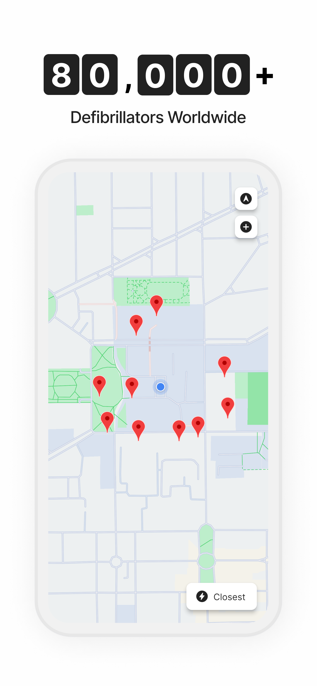
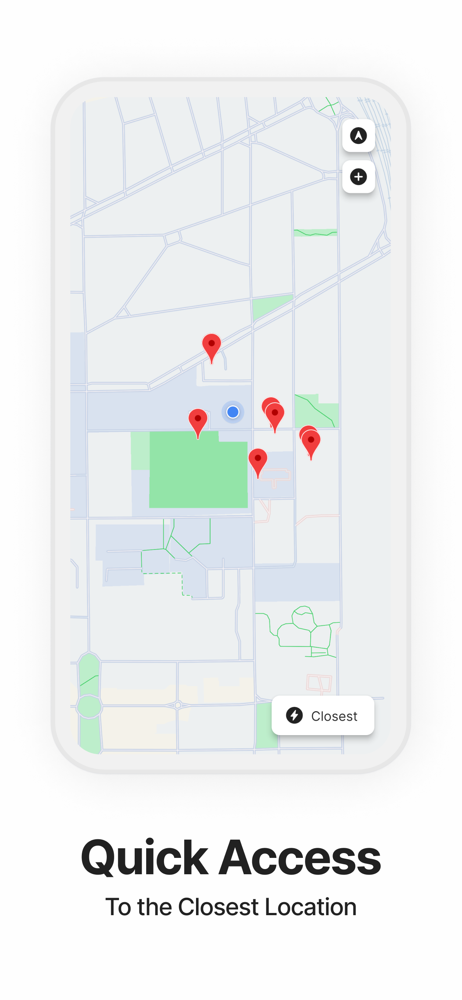
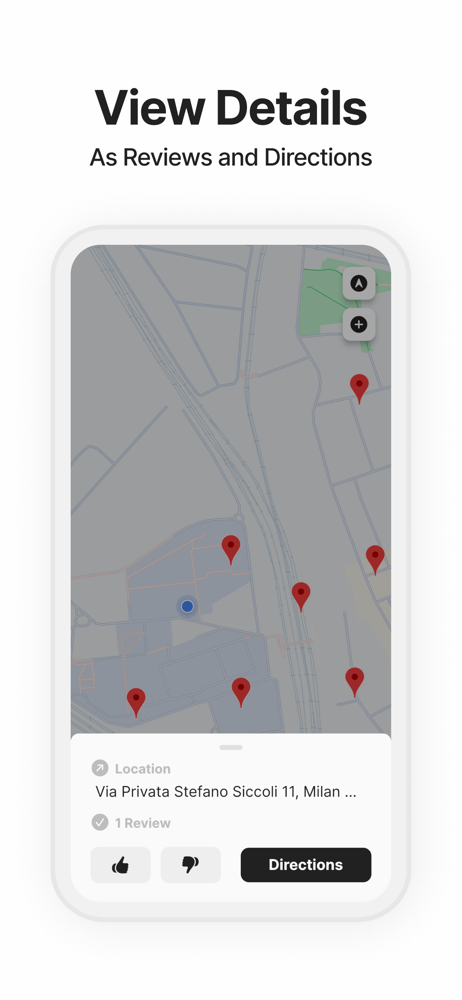
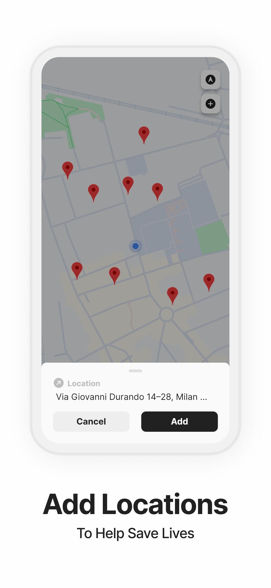

# Life Saver

Flutter app that locates nearby public defibrillators to help save lives.
Life Saver is freely available on both the [App Store](https://apps.apple.com/us/app/life-saver-aed-map/id1644552033) and the [Play Store](https://play.google.com/store/apps/details?id=dev.andreacarrara.life_saver).

<p align="center">
  
   
  
  
</p>

A growing number of countries require defibrillators in public spaces.
But they don't keep track of them! And the few who do, use slow and ugly websites. Ew!
Life Saver is both easy and powerful. When seconds matter the most the closest location is just a tap away.
When details are more important you can check reviews and directions, or add new locations to help others in need.
More than 80,000 defibrillators have already been added, mainly in Europe and New Zealand.
Join the community and help grow the database to cover the whole world!

## Technologies

Project built with:

- [Flutter](https://flutter.dev) to build the user interface.
- [Firebase Firestore](https://firebase.google.com/products/firestore) to store and query the locations.

## Installation

Clone the repository and run:

```bash
$ flutter pub get
```
